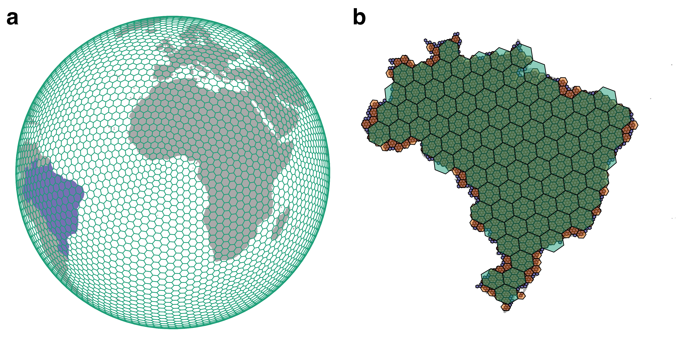

# PhanGrids: a Phanerozoic gridded dataset of palaeogeographic reconstructions

Author(s): [Lewis A. Jones](mailto:LewisA.Jones@outlook.com) and [Mathew Domeier](mailto:mathewd@uio.no)

This repository contains the data and code required to generate the materials for the article "PhanGrids: a Phanerozoic gridded dataset of palaeogeographic reconstructions" (Jones and Domeier, 2024). 

To cite the paper: 

> Jones, L.A. and Domeier, M.M. 2024. PhanGrids: a Phanerozoic gridded dataset of palaeogeographic reconstructions. (TBC).

To cite this repository:

> Jones, L.A. and Domeier, M.M. 2024. PhanGrids: a Phanerozoic gridded dataset of palaeogeographic reconstructions. GitHub Repository: https://github.com/LewisAJones/PhanGrids.

#### NOTE: All reconstructions files are deposited on the dedicated [Zenodo repository](https://zenodo.org/records/10607398).

Example of [H3’s discrete global grid system](https://h3geo.org). (a) A H3 global grid at resolution 2 (~316.12 km cell spacing). Land masses are depicted in grey, except for Brazil, which is depicted in purple. The grid is illustrated in a Lambert azimuthal equal-area projection. (b) H3 grids overlaid on Brazil at resolutions 2, 3, and 4, which have an average cell spacing of ~316 km, ~119 km, and ~45 km, respectively. The map illustrates the hierarchical nature of the H3 geospatial indexing system.

----

## Data

* `data/` contains `pbdb_data.csv`, a dataset of fossil collections from [the Palaeobiology Database](https://paleobiodb.org/#/).
* `data/` contains `resolution_2.RDS`, an example reconstruction file (H3 resolution 2) using the [Merdith et al. (2021)](https://doi.org/10.1016/j.earscirev.2020.103477) Global Plate Model.

## Python

* `python/` contains the subfolder `plate_models`, which contains the static polygons and rotation files for the five Global Plate Models used here:

| Abbreviation | Temporal coverage | Reference                |
| ------------ | ----------------- | ------------------------ |
| WR13         | 0–550 Ma          | Wright et al. (2013)     |
| MA16         | 0–410 Ma          | Matthews et al. (2016)   |
| TC16         | 0–540 Ma          | Torsvik and Cocks (2016) |
| SC16         | 0–1100 Ma         | Scotese (2016)           |
| ME21         | 0–1000 Ma         | Merdith et al. (2021)    |

* `python/` contains `make_grids.ipynb`, which provides a Jupyter Notebook documenting the process used to make the reconstruction grids.
* `python/` contains `look_up.ipynb`, which provides a Jupyter Notebook which can be used to generate reconstructed coordinates for user data from the reconstruction files.

## R

* `R/` contains the subfolder `figures`, which provides the R code used to generate figures for the article.
* `R/` contains `look_up.R`, which provides an R script which can be used to generate reconstructed coordinates for user data from the reconstruction files.

## References

1. Matthews, K. J., Maloney, K. T., Zahirovic, S., Williams, S. E., Seton, M., & Müller, R. D. (2016). Global plate boundary evolution and kinematics since the late Paleozoic. Global and Planetary Change, 146, 226–250. https://doi.org/10.1016/j.gloplacha.2016.10.002.

2. Merdith, A. S., Williams, S. E., Collins, A. S., Tetley, M. G., Mulder, J. A., Blades, M. L., Young, A., Armistead, S. E., Cannon, J., Zahirovic, S., & Müller, R. D. (2021). Extending full-plate tectonic models into deep time: Linking the Neoproterozoic and the Phanerozoic. *Earth-Science Reviews*, 214, 103477. https://doi.org/10.1016/j.earscirev.2020.103477.

3. Scotese, C. R. (2016). Tutorial: PALEOMAP paleoAtlas for GPlates and the paleoData plotter program: PALEOMAP Project, Technical Report.

4. Torsvik, T. H., & Cocks, L. R. M. (2017). Earth history and palaeogeography. *Cambridge University Press*. https://doi.org/10.1017/9781316225523.

5. Wright, N., Zahirovic, S., Müller, R. D., & Seton, M. (2013). Towards community-driven paleogeographic reconstructions: Integrating open-access paleogeographic and paleobiology data with plate tectonics. *Biogeosciences*, 10, 1529–1541. https://doi.org/10.5194/bg-10-1529-2013.

